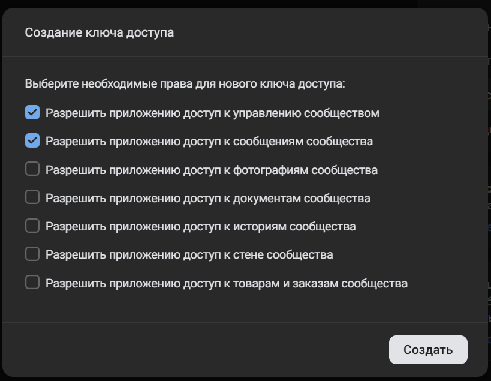
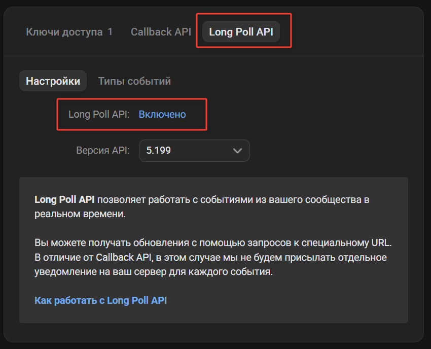
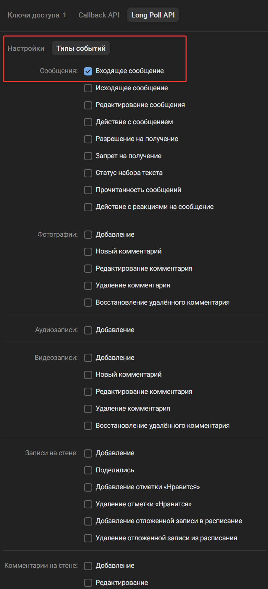
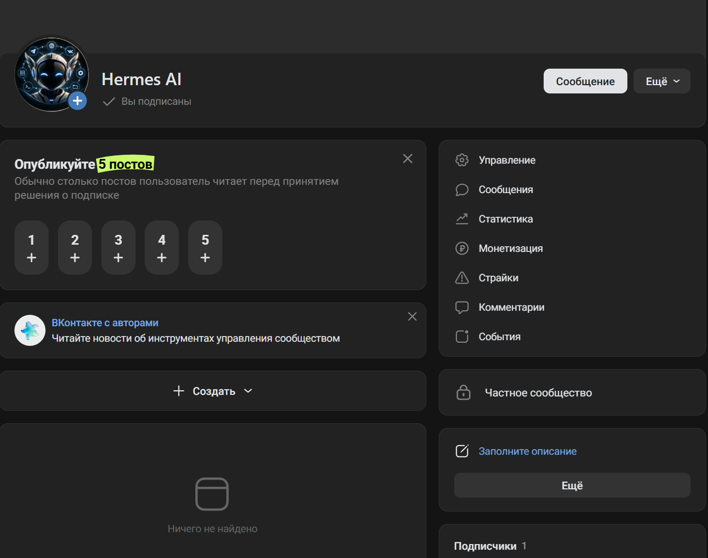
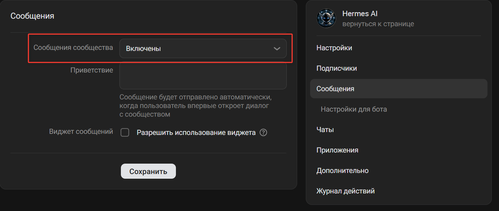
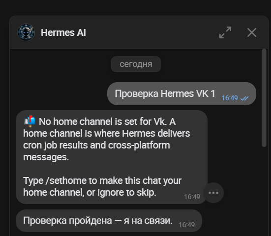
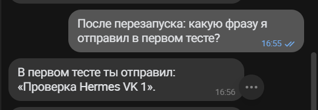
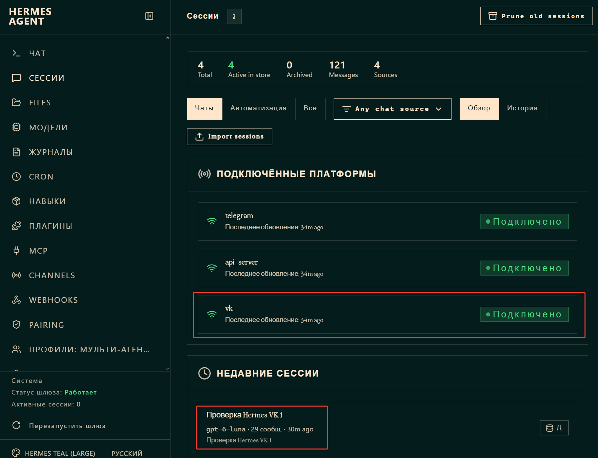

# Hermes VK Adapter

VK (VKontakte) platform adapter for Hermes Agent, using the VK Bots Long Poll API.

## Overview

Hermes VK Adapter adds private VK community messages as a messaging platform handled by Hermes Agent. It is a Hermes platform plugin, not a separate AI bot or an HTTP bridge.

```text
VK user → VK community → VK Bots Long Poll API → Hermes VK Adapter → Hermes Agent
                                                                  ↓
VK user ← VK community ← VK messages.send ← Hermes VK Adapter ← Hermes reply
```

The adapter makes an outbound Long Poll connection to VK. It does not need a public IP address, an inbound port, a webhook, or the VK Callback API.

## Features and scope

- Receives private messages sent to a VK community and sends Hermes replies to the same user.
- Creates normal Hermes platform sessions; repeated messages use the same session identity.
- Restricts inbound handling and outbound delivery to users in `VK_ALLOWED_USERS`.
- Reconnects after Long Poll transport/API errors and resumes from its cursor after restart.
- Splits long replies to fit VK's message size limit.
- Initial version supports private text messages only. Group conversations, attachments, and other VK event types are not supported.

## Architecture

The adapter registers the `vk` platform through Hermes' platform plugin API. It calls `groups.getLongPollServer`, consumes community events using VK Bots Long Poll, converts allowed incoming text into Hermes `MessageEvent`s, and sends replies through `messages.send`. Hermes owns conversation/session history; the adapter stores only the Long Poll cursor.

## Requirements and compatibility

- Hermes Agent platform plugin support. Verified against Hermes Agent `0.21.0`, revision `37f3ba110a1b537fe261d1e64c479fb37b3119af`. Other versions have not been verified.
- VK API version `5.199`, used in the verified integration.
- A VK community access token with **messages** and **manage** permissions. In the tested setup, `messages` alone returned VK error `15` (subcode `1133`) for `groups.getLongPollServer`.
- Community messages and the Long Poll **Incoming message** event enabled.

## VK community setup

1. Create or choose a VK community and enable community messages.
2. Create a community access token with the **messages** and **manage** permissions. The `manage` permission is needed for `groups.getLongPollServer` in the verified setup.

   

3. Enable Long Poll and its incoming message event.

   
   

4. Install and enable the plugin using the mechanism supported by your Hermes version. On Hermes Agent `0.21.0`, the persistent plugin directory was `$HERMES_HOME/plugins/vk-platform`, and `hermes plugins enable vk-platform` enabled it. Keep the plugin on persistent storage when Hermes runs in a container; do not install it only into an ephemeral container filesystem.
5. Configure the variables below using Hermes' supported environment or secret mechanism.
6. Start or restart Hermes and verify that the `vk` platform connects.

   
   

## Configuration

The adapter reads these environment variables:

| Variable | Required | Description |
| --- | --- | --- |
| `VK_TOKEN` | Yes | Secret VK community access token. |
| `VK_GROUP_ID` | Yes | Numeric ID of the VK community that owns the token. Replace the example with your community ID. |
| `VK_ALLOWED_USERS` | Yes for message handling | Comma-separated numeric VK user IDs permitted to use the agent. Replace the example with the IDs you want to allow. |

Example values below are fictitious:

```dotenv
VK_TOKEN=<your-community-token>
VK_GROUP_ID=123456789
VK_ALLOWED_USERS=12345678
```

Do not remove the allowlist. Hermes may have access to tools and private context, so allow only trusted VK user IDs. Keep the token in a secret manager or an untracked environment file with restrictive permissions.

## Running and restarting Hermes

Start or restart Hermes using the service or container manager for your installation. The plugin reconnects to VK Long Poll when Hermes starts the platform runtime. Its cursor is stored separately from conversation history, so the adapter can resume Long Poll after restart without taking ownership of Hermes sessions.

## Verification

1. Confirm Hermes platform status reports `vk` as connected.
2. Send a direct message from an allowlisted VK account and confirm Hermes receives it.
3. Confirm the reply appears in the same VK conversation.
4. Send another message and verify that it continues the same Hermes session.
5. Restart Hermes, send another message, and verify reconnection and session continuity.
6. Send a message from a non-allowlisted account and verify it is ignored.

The screenshots document the VK → Hermes → VK exchange and connected status observed in the verified setup. They are examples, not a substitute for checking your own deployment.





## Session persistence

The session identity is generated through Hermes' normal platform/session contract for a VK private conversation. The adapter persists only the Long Poll cursor. Hermes' configured session store handles conversation history.

## Security

- Never commit `VK_TOKEN`, `.env` files, SSH keys, Long Poll keys, or runtime state/logs.
- Grant the VK community token only the permissions required by this adapter: `messages` and `manage`.
- Keep `VK_ALLOWED_USERS` configured and allow only trusted users.

## Troubleshooting

- **`groups.getLongPollServer` returns error `15` / subcode `1133`:** verify that the configured token is a community token for `VK_GROUP_ID` and has both `messages` and `manage` permissions. In the verified setup, a token with only `messages` was insufficient.
- **No incoming messages:** verify that community messages and Long Poll are enabled and that the **Incoming message** event is selected.
- **The adapter connects but a user gets no response:** verify that the user's numeric VK ID is in `VK_ALLOWED_USERS`; users outside the allowlist are ignored.
- **Token/community mismatch:** configure a community token belonging to the community identified by `VK_GROUP_ID`. Never paste the token into logs or support requests.
- **Plugin not discovered:** verify that the plugin is in the persistent Hermes plugin directory, `plugin.yaml` is present, and the plugin is enabled using the mechanism supported by your Hermes version.
- **A `Redirected current run` status appears in VK:** this status was observed once during a real integration check and originated in Hermes' gateway redirect path. The installed plugin send contract provides text but no confirmed message-origin marker, so the adapter cannot safely suppress only internal status messages without risking suppression of legitimate replies. This runtime limitation remains unresolved; a `v0.1.0` release/tag is deferred until the status can be distinguished or the VK path is verified again.

## Development and tests

Run the Hermes-independent adapter tests:

```sh
python -m unittest -v test_adapter.py
```

Run the Hermes contract smoke test in an environment that can import the installed Hermes packages:

```sh
python smoke_hermes.py
```

Unit tests, contract smoke tests, and automated checks do not constitute a live VK end-to-end test. A real end-to-end check requires a configured community token and verification of VK → Hermes → VK, allowlist behavior, reconnect, and restart/session persistence.

## License

MIT. See [LICENSE](LICENSE).
